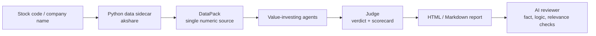

# A-Share Value Copilot

[中文](./README.md) | [English](./README.en.md)

> An open-source, local AI research copilot for China A-shares. It encodes "good business / good company / good price" into value-investing agents, runs diligence, writes structured reports, and asks a separate AI reviewer to check the work.
>
> **ai-hedge-fund teaches you to build a hedge fund. A-Share Value Copilot tries to help you trade less.**

[](https://github.com/hahahuahai/ashare-value-copilot/actions/workflows/ci.yml) [](https://github.com/hahahuahai/ashare-value-copilot/releases/latest) [](https://github.com/hahahuahai/ashare-value-copilot/releases/latest) [](https://github.com/hahahuahai/ashare-value-copilot/releases)   

**Positioning: a local AI research desk for China A-share investors and builders.**

No paid market-data API, no model-invented numbers, and no buy/sell calls. The app helps you decide whether a company deserves deeper research, with evidence, disagreements, and unknowns shown explicitly.

## See The Output

| Stock | Sample | Verdict | One-liner |
|---|---|---|---|
| Ping An `601318` | [HTML](./reports/601318-e2e-2026-05-10.html) · [meta](./reports/601318-e2e-2026-05-10.meta.json) | `worth_research` | PE 8.19 at the 21st percentile; strong financial ecosystem, but investment book needs scrutiny. |
| FII `601138` | [HTML](./reports/601138-e2e-2026-05-10.html) · [meta](./reports/601138-e2e-2026-05-10.meta.json) | `pass` | PE 30.89 at the 92nd percentile; contract manufacturing leader with thin margins. |
| Kweichow Moutai `600519` | [Markdown](./reports/600519-2026-05-10.md) | sample | Early CLI Markdown report sample. |

More examples are collected in the [sample report gallery](./docs/sample-reports.md).



---

## Why This Exists

Most AI stock-picking tools have three problems:

1. **Black boxes**: they give you a score without explaining whether the business, company, or price is good.
2. **Hype chasing**: the LLM invents numbers and follows momentum.
3. **US-stock bias**: China A-share data is harder to access and often hidden behind paid APIs.

This project takes the opposite route:

- **A-share native**: free data through akshare, no paid market-data API required.
- **Value-investing agents**: multiple Chinese-language value-investing personas with forced `PASS / FAIL / GRAY` conclusions.
- **Circle-of-competence gatekeeping**: if the business is not understandable, the agent is allowed to refuse analysis.
- **Anti-hallucination by design**: all numbers must come from fetched data, not model arithmetic.
- **AI reviewer**: a separate reviewer agent checks citations, contradictions, and valuation leaps.
- **Desktop app**: Electron app with Windows NSIS / portable and macOS DMG / ZIP builds, plus a bundled data sidecar.
- **Bring your own API key**: OpenAI-compatible providers including Tencent Cloud LKEAP, DeepSeek, DashScope, Zhipu GLM, Kimi, Doubao, SiliconFlow, OpenRouter, Ollama, OpenAI, Grok, and custom endpoints.

---

## Usage

### A. Desktop App, Recommended

1. Download `价投合伙人-0.2.2-x64.exe`, `价投合伙人-0.2.2-portable.exe`, or the macOS `.dmg / .zip` package from [Releases](https://github.com/hahahuahai/ashare-value-copilot/releases).
2. On first launch, fill in `LLM_BASE_URL`, `API_KEY`, and `MODEL`.
3. Enter a stock code or company name, for example `600519`, `贵州茅台`, or `中国平安`, then run the analysis.

The desktop package starts a bundled `value-copilot-sidecar`, so normal users do not need to install Python. Developers can still run the source sidecar with `pnpm sidecar`.

### Build macOS Packages Locally

```bash
corepack enable
pnpm install
pnpm desktop:dist:mac
```

The current macOS target produces Apple Silicon (`arm64`) DMG / ZIP artifacts. For public distribution, configure Apple Developer ID signing and notarization; unsigned local test builds may need to be allowed from macOS System Settings.
On macOS, the build command also generates `resources/icon.icns` from the existing PNG with the system `sips` / `iconutil` tools.

### 30-second Quick Start

```bash
pnpm install
pnpm sidecar
cp .env.example .env
# Fill LLM_BASE_URL / LLM_API_KEY / LLM_MODEL
pnpm ask 600519
```

### B. CLI, For Developers

```bash
# 1. Start the data sidecar in one terminal
cd services/data-sidecar
pip install -r requirements.txt
python main.py              # listens on http://127.0.0.1:9876

# 2. Configure your LLM in another terminal
cp .env.example .env
# Edit .env and fill LLM_BASE_URL / LLM_API_KEY / LLM_MODEL

# 3. Install dependencies and run the council
pnpm install
pnpm ask 600519             # Kweichow Moutai
pnpm ask 中国平安           # Ping An Insurance
```

Reports are written to `reports/{code}-{date}.md / .html`. Reviewer metadata is written next to the report when available.

See [RUN.md](./RUN.md) for troubleshooting.

---

## Trust Engineering

The goal is not to make the LLM sound smarter. The goal is to constrain it so the report stays auditable:

| Mechanism | What it does |
|---|---|
| Single `DataPack` truth source | Valuation, financials, dividends, quotes, and industry data are fetched before the model sees them. |
| No invented numbers | Prompts require the model to quote only numbers present in the JSON payload. Missing data must be called out. |
| Agent disagreement | Business, company, and price verdicts remain visible instead of being collapsed into one opaque score. |
| Judge cannot add evidence | The judge aggregates agent text and `DataPack`; it does not introduce new facts. |
| Independent reviewer | A separate reviewer checks citations, contradictions, valuation leaps, and relevance. |
| Traceable artifacts | HTML, Markdown, judge raw output, payload, and metadata files are saved together for debugging. |

---

## Supported LLM Providers

The desktop Settings panel includes provider presets. All providers use OpenAI-compatible chat completions. CLI users only need three `.env` variables.

| # | Provider | Suggested Models | Base URL |
|---|---|---|---|
| 1 | Tencent Cloud LKEAP Token Plan | `glm-4.6` / `kimi-k2.5` / `minimax-m2.7` | `https://api.lkeap.cloud.tencent.com/plan/v3` |
| 2 | Tencent Cloud LKEAP Pay-as-you-go | `deepseek-v3` / `deepseek-r1` / `qwen-plus` | `https://api.lkeap.cloud.tencent.com/v1` |
| 3 | DeepSeek | `deepseek-chat` / `deepseek-reasoner` | `https://api.deepseek.com/v1` |
| 4 | Alibaba DashScope | `qwen-max` / `qwen-plus` / `qwq-32b-preview` | `https://dashscope.aliyuncs.com/compatible-mode/v1` |
| 5 | Zhipu GLM | `glm-4.6` / `glm-z1-air` | `https://open.bigmodel.cn/api/paas/v4` |
| 6 | Moonshot Kimi | `moonshot-v1-128k` / `kimi-latest` | `https://api.moonshot.cn/v1` |
| 7 | Doubao / Volcano Ark | `doubao-1-5-pro-32k-250115` | `https://ark.cn-beijing.volces.com/api/v3` |
| 8 | SiliconFlow | `deepseek-ai/DeepSeek-V3` / `Qwen/QwQ-32B` | `https://api.siliconflow.cn/v1` |
| 9 | OpenRouter | `anthropic/claude-sonnet-4.5` / `google/gemini-2.5-pro` | `https://openrouter.ai/api/v1` |
| 10 | Ollama Local | `qwen2.5:14b` / `deepseek-r1:14b` | `http://127.0.0.1:11434/v1` |
| 11 | OpenAI | `gpt-4o` / `gpt-4o-mini` / `o3-mini` | `https://api.openai.com/v1` |
| 12 | xAI Grok | `grok-4-latest` / `grok-3` | `https://api.x.ai/v1` |
| 13 | Custom | Any OpenAI-compatible model | Any compatible endpoint |

Quick choices:

- **Best domestic connectivity and cost**: Tencent Cloud LKEAP Token Plan or DeepSeek.
- **Best reasoning quality if overseas latency is acceptable**: OpenRouter with Claude or Gemini.
- **Privacy and no API cost**: Ollama local models.

Example `.env`:

```bash
LLM_BASE_URL=https://api.deepseek.com/v1
LLM_API_KEY=sk-xxxxxxxxxxxx
LLM_MODEL=deepseek-chat
```

Provider smoke test:

```bash
cp .env.providers.test.example .env.providers.test
pnpm verify:providers
```

---

## Architecture

```text
Desktop (Electron) / CLI (tsx)
        |
        v
packages/agents
  - runner: OpenAI-compatible LLM calls
  - master prompts: value-investing personas
  - judge: aggregates agent opinions
  - reviewer: independent fact and logic review
        |
        v
packages/data
        |
        v
services/data-sidecar (Python + akshare)
  /search /quote /profile /financial /valuation
  /dividend /historical-pe /industry-compare /healthz
```

### Directory Guide

| Path | Purpose |
|---|---|
| `apps/cli` | TypeScript CLI entry point |
| `apps/desktop` | Electron desktop app |
| `packages/agents` | Agent personas, LLM runner, judge, reviewer |
| `packages/data` | TypeScript client for the data sidecar |
| `services/data-sidecar` | Python akshare HTTP service |
| `prompts/` | Prompt files for agents, judge, and reviewer |
| `reports/` | Generated Markdown / HTML reports |
| `landing/` | Early static landing-page prototype |

---

## Core Design Choices

| Choice | Rationale |
|---|---|
| LLMs cannot invent numbers | Investment research is fragile when numbers hallucinate. |
| `PASS / FAIL / GRAY` output | Agents must admit uncertainty instead of forcing a confident answer. |
| Judge does not add new evidence | The judge aggregates, it does not invent new facts. |
| Independent reviewer | A separate context is better at catching factual and logical issues. |
| Verdicts avoid buy/sell language | The tool is for research, not investment advice. |

---

## Roadmap

- [x] Data sidecar and value-investing prompts
- [x] CLI workflow
- [x] Judge and HTML reports
- [x] Electron desktop app
- [x] AI reviewer with retry and JSON recovery
- [x] Multi-agent value-investing council
- [x] Fuzzy A-share company/code search
- [ ] Circle-of-competence archive
- [ ] Position weekly reports
- [ ] Web UI with visualized council flow

See [CHANGELOG.md](./CHANGELOG.md) for release history.

---

## Contributing

This is currently a solo project, but issues, forks, ideas, and PRs are welcome.

To add a new investing persona, add a prompt under `prompts/`, register it in `packages/agents/src/masters.ts`, and wire it into the existing runner flow.

---

## Disclaimer

This tool is for **research assistance only**. It is not investment advisory software. Outputs are intended to help you think independently and do not constitute buy, sell, or hold recommendations. You are responsible for your own investment decisions.

---

## License

[MIT](./LICENSE) © 2026 huahai
